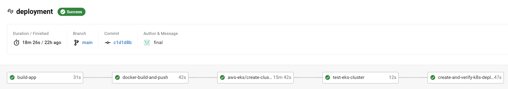

# Udacity Devops NanoDegree - Capstone Project 5

Final project of Udacity Cloud DevOps Engineer Nanodegree Program.

## Project Overview
In this project I have implemented all the knowledge that I have gained from the Udacity Cloud DevOps Engineer Nanodegree program. 


In this project I have created CICD Pipeline using Circle CI to do:
- Create Docker image with application
- Push Docker image to docker hub
- Created CICD Pipeline to create and setup EKS cluster in AWS. 
- Deploys the application Docker container in the kubernetes cluster.

## Pre-requisite
- Create account GitHub
- Login CircleCI with GitHub
- Setup GitHub repo/project in CircleCI
- Create user access and secret keys on AWS
- Signup Docker Hub
- Add Environment Variables in CircleCI
    - Add AWS secret keys 
        - AWS_ACCESS_KEY_ID
        - AWS_SECRET_ACCESS_KEY
        - AWS_DEFAULT_REGION
    - Add Docker login
        - DOCKER_LOGIN
        - DOCKER_PASSWORD


## Application

The application is a simple Python flask script that returns some text.

```
from flask import Flask

app = Flask(__name__)

@app.route('/')
def home():
    return "<h1 style='text-align: centre;'>Natwest Udacity Capstone Project</h1>"

if __name__ == '__main__':
    app.run(host='0.0.0.0', port=80, debug=True)
```

## CircleCi Pipeline

I am using circleci pipeline for automated deployment. The pipeline does the following



1. Job - build app

    Builds the app in virtualenv, installs dependencies from ```requirements.txt``` and performs lint against ``Dockerfile`` and ``app.py``.

2. Job - docker-build-and-push

    This builds the docker image and pushes the image to docker repositary.

3. Job - aws-eks/create-cluster

    This code is in the workflow section. This job creates a Kubernetes cluster in AWS EKS

4. Job - test-eks-cluster

    This job is to verify cluster is up and running

5. Job - create-and-verify-k8s-deployment

    Once test is completed, this job uses the ```deployment.yml``` file to deploy the docker application and create a load balancer. It then outputs cluster information to verify if it has been deployed.

## Improvement Suggestions

- Improve rolling deployment by adding logic to check if cluster already exists and to move on to update cluster with new docker container
- A job to perform health check post deployment
- Use Docker token to push and pull images

<br/><br/>
<br/><br/>
<br/><br/>
<br/><br/>

## Original Project Overview

In this project you will apply the skills and knowledge which were developed throughout the Cloud DevOps Nanodegree program. These include:

Working in AWS
Using Jenkins or Circle CI to implement Continuous Integration and Continuous Deployment
Building pipelines
Working with Ansible and CloudFormation to deploy clusters
Building Kubernetes clusters
Building Docker containers in pipelines
As a capstone project, the directions are rather more open-ended than they were in the previous projects in the program. You will also be able to make some of your own choices in this capstone, for the type of deployment you implement, which services you will use, and the nature of the application you develop.

You will develop a CI/CD pipeline for micro services applications with either blue/green deployment or rolling deployment. You will also develop your Continuous Integration steps as you see fit, but must at least include typographical checking (aka “linting”). To make your project stand out, you may also choose to implement other checks such as security scanning, performance testing, integration testing, etc.!

Once you have completed your Continuous Integration you will set up Continuous Deployment, which will include:

Pushing the built Docker container(s) to the Docker repository (you can use AWS ECR, create your own custom Registry within your cluster, or another 3rd party Docker repository) ; and
Deploying these Docker container(s) to a small Kubernetes cluster. For your Kubernetes cluster you can either use AWS Kubernetes as a Service, or build your own Kubernetes cluster. To deploy your Kubernetes cluster, use either Ansible or Cloudformation. Preferably, run these from within Jenkins or Circle CI as an independent pipeline.